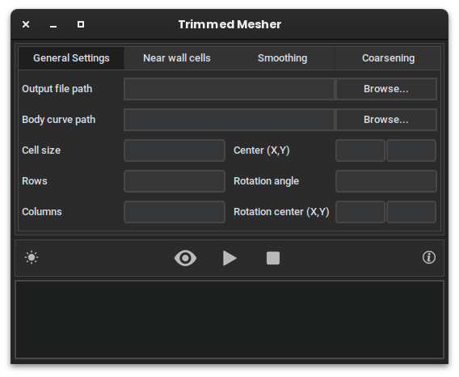
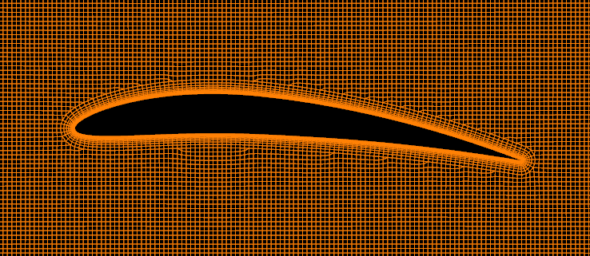
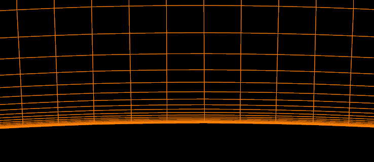
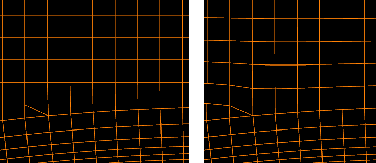

# Trimmed Mesher
 

This repository contains a **C implementation** of a **trimmed mesher** designed for **Computational Fluid Dynamics (CFD)** simulations. The mesher generates a **cartesian 2D conformal grid** composed of square cells and adapts it to incorporate an **embedded closed curve**, representing an obstacle within the flow domain.

In addition to the core meshing algorithms, this project includes a **Python-based GUI** built with **CustomTkinter**, which provides an easy-to-use interface for users to interact with the mesher, without the need for command-line interface (CLI) knowledge.

<p align="center">
  
</p>

Key features of the project include:
- **Semi-cartesian conformal mesh** generation for accurate CFD simulations.

<p align="center">
  
</p>

- **Near-wall cells optimizations** for accurate simulations of boundary layers.

<p align="center">
  
</p>

- **Smoothing** algorithms to improve mesh quality.

<p align="center">
  
</p>

- **External coarsening** for large simulation domains.

<p align="center">
  
</p>


## Usage

### Input curve format
The input curve must be provided as a **CSV file** with **X, Y coordinates** separated by a comma. The file should represent a **closed polygonal curve**. It is important that there are no duplicated points in the curve, as the program will rely on unique points for mesh generation. Here’s an example of the format:

```
X1, Y1
X2, Y2
...
XN, YN
```

### Output mesh file
The generated mesh will be saved in the **GMSH ASCII format (version 2.2)**, which includes both **nodes** and **elements**. This format is widely used and can be further processed in simulation tools like GMSH, OpenFOAM, and others. Here's an example of the output structure:

```
$MeshFormat
2.2 0 8
$EndMeshFormat
$Nodes
<node data>
$EndNodes
$Elements
<element data>
$EndElements
```

## Building

### Requirements

- C compiler (e.g., `gcc`, `clang`, etc.)
- Standard C libraries (`stdio.h`, `stdlib.h`, `math.h`)
- [CMake](https://cmake.org/download/) (version 3.10 or higher)
- [git](https://git-scm.com/downloads) (optional, for version control)
- Python 3.6 or higher (for the GUI)
- [Python virtual environment](https://docs.python.org/3/library/venv.html) (for managing dependencies)
- [PyInstaller](https://pyinstaller.org/) (for building the GUI executable)

### Compiling the Core

To compile the C code, navigate to the project directory and use the following commands:

```bash
mkdir build
cd build
cmake ..
make
```

The compiled executable will be generated inside the `build` folder.

### Building the GUI

To build the GUI, you first need to install all the Python dependencies. To do so, follow these steps:

1. Create and activate a Python virtual environment:

```bash
python3 -m venv .venv
source .venv/bin/activate   # For Unix/macOS
.venv\Scripts\activate      # For Windows
```

2. Install the Python requirements:

```bash
pip install -r requirements.txt
```

3. Install [PyInstaller](https://pyinstaller.org/) to build the GUI executable:

```bash
pip install pyinstaller
```

4. Navigate to the `gui` folder in the project directory:

```bash
cd gui
```

5. Build the GUI executable using PyInstaller:

```bash
pyinstaller --onefile --windowed \
  --add-binary "../build/mesher:mesher" \
  --add-data "theme.json:." \
  --add-data "images:images/" \
  --add-data "../.venv/lib/python3.x/site-packages/PIL:PIL/" \
  --icon=images/icon.png \
  -n "Trimmed Mesher" --clean gui.py
```

Make sure to replace `python3.x` with the version of Python you are using (e.g., `python3.12`).

The executable file will be created in the `gui/dist` folder.

## License
This project is licensed under the Apache 2.0 License. See the [LICENSE](LICENSE) file for details.